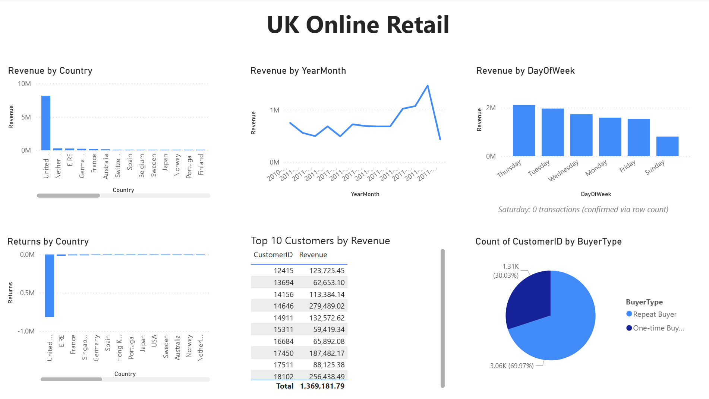

# Retail Sales Dashboard (Power BI)

## Overview
A Power BI dashboard built on top of the [SQL analysis](../sql/) of the same UK Online Retail dataset, turning the key findings into an interactive, visual format. Where the SQL stage answers specific questions one at a time, this dashboard lets one explore revenue, returns, and customer patterns at a glance.

## Tools
- Power BI Desktop
- DAX: measures (SUMX, CALCULATE, IF), calculated columns (FORMAT for date parsing)

## Data source
Same dataset as the SQL stage — exported from `retail.db` as `orders.csv` and loaded directly into Power BI (not included in this repo due to size; see the [SQL README](../sql/README.md#how-to-run) for how to obtain and prepare it).

## Visuals

**Revenue by Country** — bar chart. Confirms the SQL finding that the UK accounts for the overwhelming majority of revenue (~£8.19M), dwarfing every other market.

**Revenue by YearMonth** — line chart. Shows the November 2011 peak clearly, and the sharp drop into December 2011, which (per the SQL analysis) reflects incomplete data rather than an actual decline — the dataset cuts off nine days into the month.

**Returns by Country** — bar chart. Visualises just how concentrated returns are in the UK (-£815K), compared to every other country combined.

**Revenue by Day of Week** — bar chart, with an annotation confirming Saturday has zero transactions across the entire dataset (verified via row count in SQL, not just a low bar here).

**Top 10 Customers by Revenue** — table. Matches the SQL result exactly (£1,369,181.79 combined), used here as a cross-check that the DAX measures and the SQL queries agree.

**One-time vs. Repeat Buyers** — pie chart. Shows the 70/30 split (69.97% repeat, 30.03% one-time) that's one of the strongest signals in this dataset pointing toward a wholesale/B2B customer base rather than casual retail.

## Note on terminology
As in the SQL stage, "Returns" here refers to item returns (negative-quantity transactions), not ROI or profit. This dataset contains only selling price, not cost price, so profit cannot be calculated from it.

## A few DAX/build notes worth mentioning
- `YearMonth` and `DayOfWeek` are calculated columns using `FORMAT()`, mirroring the `strftime()` logic from the SQL queries.
- `Revenue` and `Returns` are measures built with `SUMX` + `IF`, the DAX equivalent of `SUM(CASE WHEN ... THEN ... ELSE 0 END)` in SQL.
- The Top 10 Customers table needed two stacked filters on `CustomerID` — one excluding blank/unidentified customers, one limiting to the top 10 by revenue — since Power BI's Top N filter and basic filter can't be combined in a single card.
- Line and bar charts needed their sort order set explicitly; Power BI defaults to sorting by value rather than by date/category, which initially produced a chronologically scrambled revenue-by-month chart.

## Next Steps
- Scale this pipeline with PySpark and deploy via cloud storage
